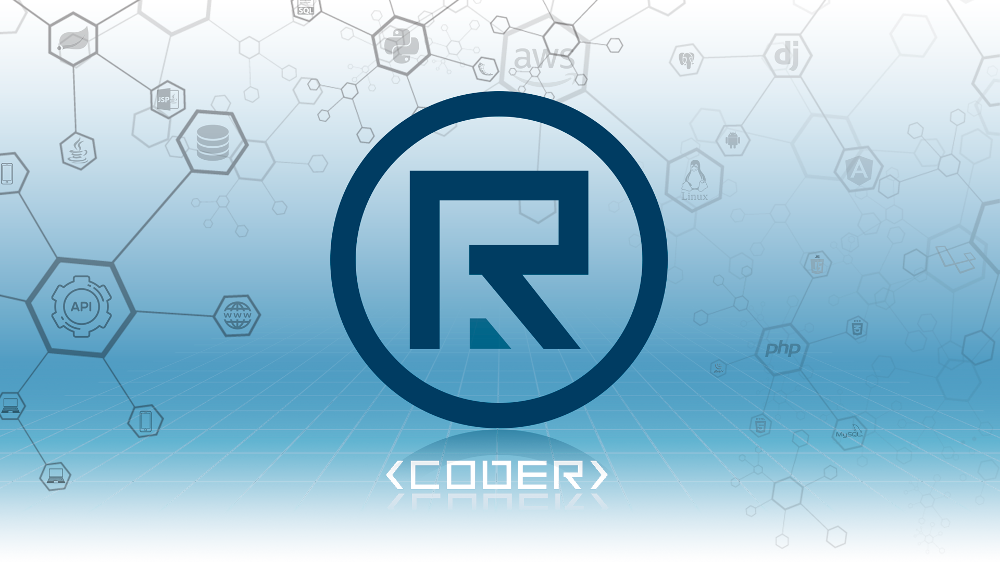

# 👋 Hi there, mi nombre es Roberto 

### Full-Stack Web and Android Developer

Con más de 10 años de dedicados al mundo de la informática. Comencé mi carrera desempeñando funciones
como técnico y administrador de sistemas, habilidad que me ha llevado a tener una mejor compresión
de la informática en general.

En 2015, decidí enfocarme en el desarrollo de sotfware, encajaba mejor
con mi entusiasmo y desarrollar aplicaciones Web me parecía muy interesante, creativo y con 
muchas posibilidades.  Al tiempo, mi curiosidad por el mundo mobile y gracias a varias 
oportunidades laborales, me adentré en el desarrollo de aplicaciones para Android, 
lo cual fue un reto para mí y una forma de aplicar mis conocimientos web adquiridos.

En estos años, he estado y sigo formándome en estas áreas de manera autodicta desarrollando
proyectos a nivel personal y para empresas como profesional, aportándome formación y 
experiencia para ser mejor desarrollador.

En mi Git encontrarás desde ejemplos simples a proyectos completos desarrollados con diversas
tecnologías y lenguajes de programación, que han llamado mi atención y curiosidad por aprender.
Y aunque no está todo...;), iré ampliándolo a modo de tener una fuente de consulta.

Actualmente adquiriendo buenas prácticas en el desarrollo, Kotlin y su ecosistema
para el desarrollo Android y Back-end, y con gran interés en profundizar en el mundo Python
con Flask, Django vs Spring Java y el stack en Angular, y siempre con la vista en PHP, sí..., mucho que aprender,
la tecnología está para probarla y usarla. 

Si mis habilidades y conocimientos como desarrollador pueden aportar y ayudarte,
házmelo saber contactando conmigo.

Un saludo y espero te sea de utilidad, ...:)

## Skills and knowledge:

 

 

 
y más ...

## Contact me:

<!--
**robertogarcor/robertogarcor** is a ✨ _special_ ✨ repository because its `README.md` (this file) appears on your GitHub profile.

Here are some ideas to get you started:

- 🔭 I’m currently working on ...
- 🌱 I’m currently learning ...
- 👯 I’m looking to collaborate on ...
- 🤔 I’m looking for help with ...
- 💬 Ask me about ...
- 📫 How to reach me: ...
- 😄 Pronouns: ...
- ⚡ Fun fact: ...
-->
